# Funcionalidade SMART RÉGUA no IOTHUB 

Este guia foi criado para auxiliar as equipes de operação da **Eletromidia** a explorar e utilizar a funcionalidade **SMART RÉGUA** de forma eficiente na plataforma <a href="https://iothub.eletromidia.com.br/" target="_blank" rel="noopener noreferrer">**IOTHUB**</a>. 

A funcionalidade permite que você execute comandos de reinicialização (Reset) remota no NUC e no Modem do equipamento vinculado, agilizando a solução de problemas a distância. 

## 1. Acesso à Funcionalidade SMART RÉGUA 

Siga estes passos para iniciar: 

1.  No menu principal (lado esquerdo da plataforma IOTHUB), localize a listagem dos componentes. 

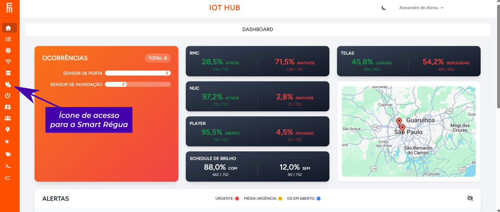

2.  Selecione a opção **"SMART RÉGUA"** para acessar a lista de dispositivos. 

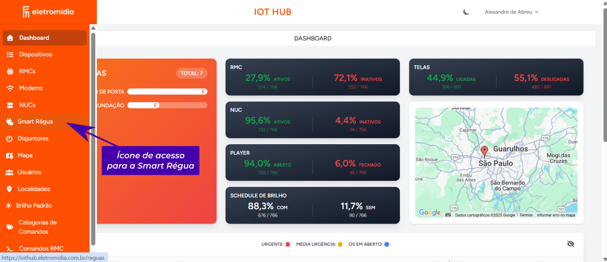

--- 

## 2. Visualização e Informações do Dispositivo 

Ao carregar a página da funcionalidade, a lista das SMART RÉGUAS será exibida. 

### Campos de Identificação 
Verifique as informações do dispositivo por meio dos seguintes campos na listagem: 

* **Nome, SEP e Endereço** 
* **MAC Address** 
* **Data e Hora de Registro** 

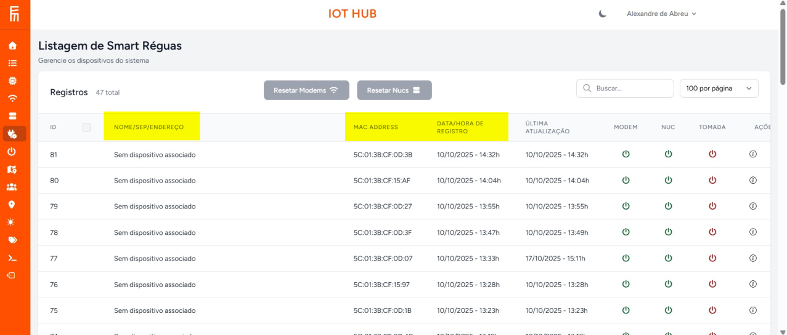

### Observação sobre o Cadastro Automático 
Se o campo **"Nome, SEP e Endereço"** exibir o status **"Sem Dispositivo Associado"**, o cadastro automático ainda não foi concluído. 

O cadastro é realizado automaticamente após a instalação física da SMART RÉGUA no equipamento: ela se vinculará ao NUC e importará as informações de identificação (Nome, SEP e Endereço) para a plataforma. 

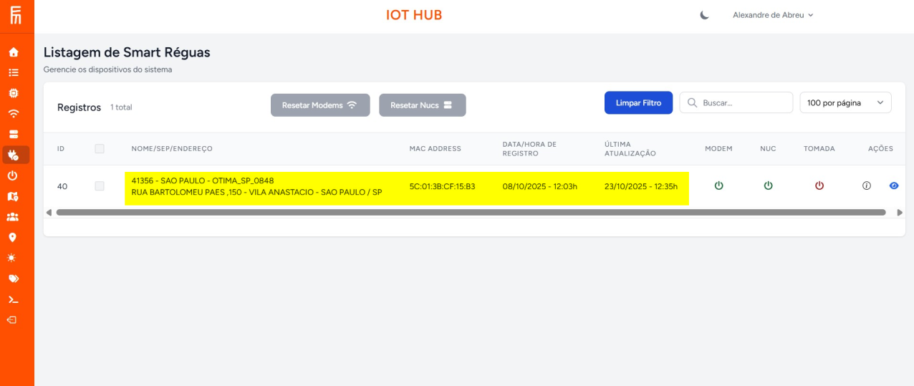

--- 

## 3. Execução de Comandos de Reset (Modems e NUCs) 

Após a conclusão do cadastro automático, o sistema habilita os comandos de Reset a distância. 

### Regras de Comando 
* O comando de reset pode ser executado para **Modems** ou **NUCs**. 
* **Só é possível resetar um dispositivo (Modem ou NUC) por vez.** 

 

### Procedimento de Reset 
O comando de reset pode ser executado de duas formas: 

1.  **Pela Listagem Principal (Ações Rápidas):** 
    * Na linha da régua desejada, localize os botões de Reset (ícones de energia) nas colunas **MODEM** ou **NUC**. 
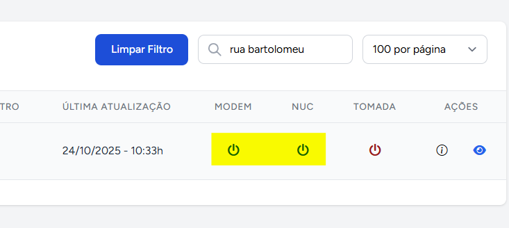

2.  **Pela Página de Detalhes (Botões Superiores):** 
    * Utilize os botões **Reset Modems** ou **Reset Nucs** localizados no topo da página de detalhes da régua (acessada pelo ícone "Olho"). 

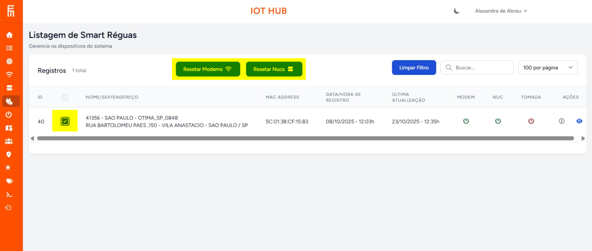

### Confirmação 
1.  Ao acionar o comando, o sistema solicitará a confirmação: **"Confirmar Envio do comando"**. 
2.  Clique em **"Sim, Enviar"** para iniciar a operação. 

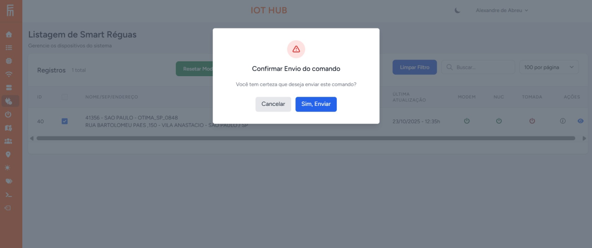

--- 

## 4. Detalhes e Ações do Dispositivo 

O botão **"AÇÕES"** (lado direito da plataforma) permite acessar as informações e comandos avançados da régua. 

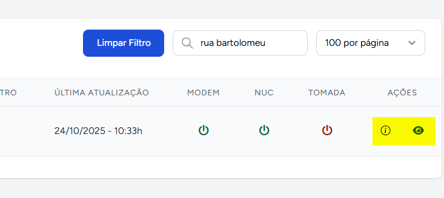

### Ícone de Informações (`i`) 
Ao clicar no ícone de "Informações", você terá acesso a um resumo do dispositivo, incluindo o histórico de comandos executados. 
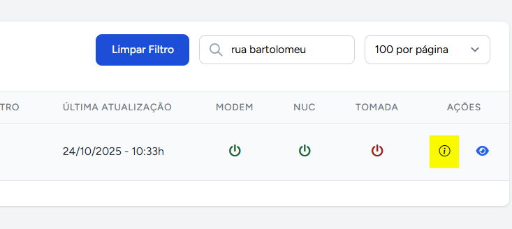
Após clicar no ícone de "Informações", aparecerá o painel registrado abaixo, com os dados respectivos do dispositivo.
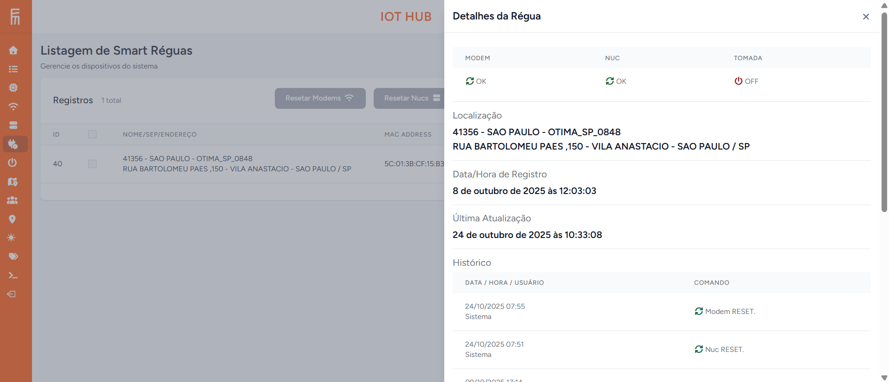

### Ícone de Visualização (`Olho`) 
Este ícone abre a **página detalhada da SMART RÉGUA**. Nesta página, é possível: 

* Consultar dados detalhados e históricos do equipamento. 
* Executar ações de reinicialização (Resetar Modem/NUC). 
* Controlar o estado da **Tomada** (Liga/Desliga) do equipamento vinculado. 
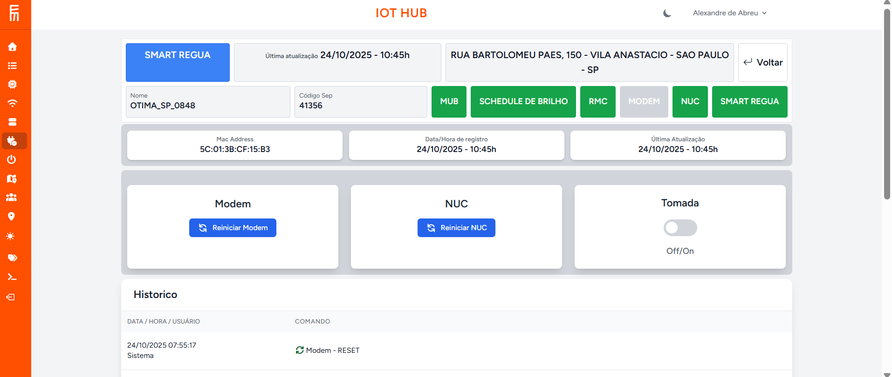

--- 

## Dicas e Suporte 

* Se encontrar qualquer dificuldade na execução dos comandos, verifique se todos os campos obrigatórios foram preenchidos corretamente. 
* Em caso de dúvidas ou necessidade de assistência, entre em contato com o departamento de **Projetos/Pesquisa e Desenvolvimento**.